# Bamazon
bamazonCustomer
This is a command line program that takes in orders from customers and depletes stock from the store's inventory which is stored in MySQL.
When the client runs the app in node it will automatically create a table first displaying all of the items available for sale, including the ids, names, and prices of products for sale.
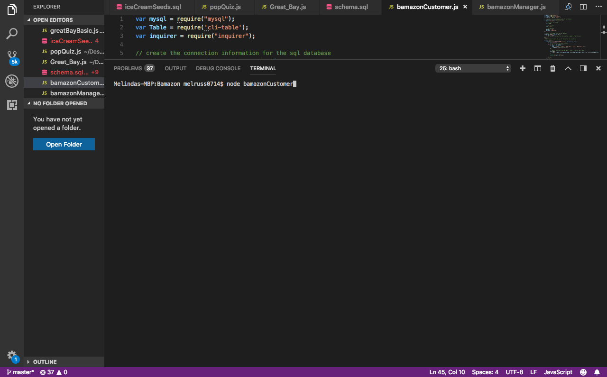
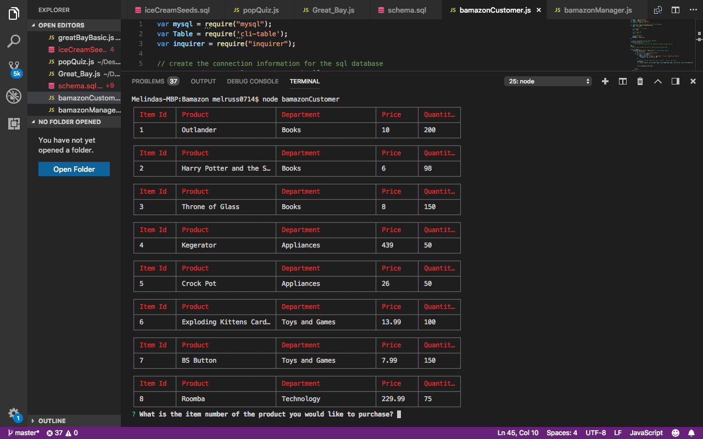

The client will then be asked what the item number of the item they want to purchase is and the quantity that they would like to purchase.
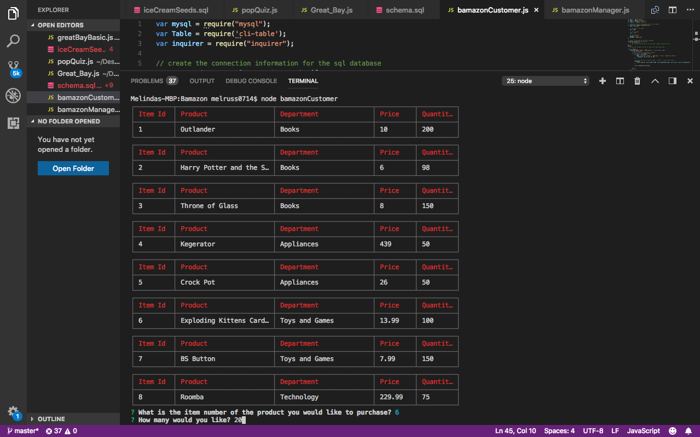
The screen then displays that your order has been placed and repreints the table with all the products for sale showing the updated quantity again asking the client what they would like to buy next.
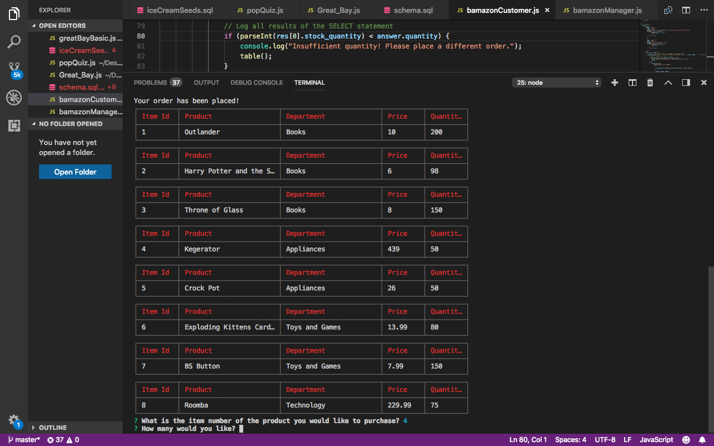

If there is not enough inventory the screen will display that there is not enough inventory, reprint the table, and ask for the item number to purchase.

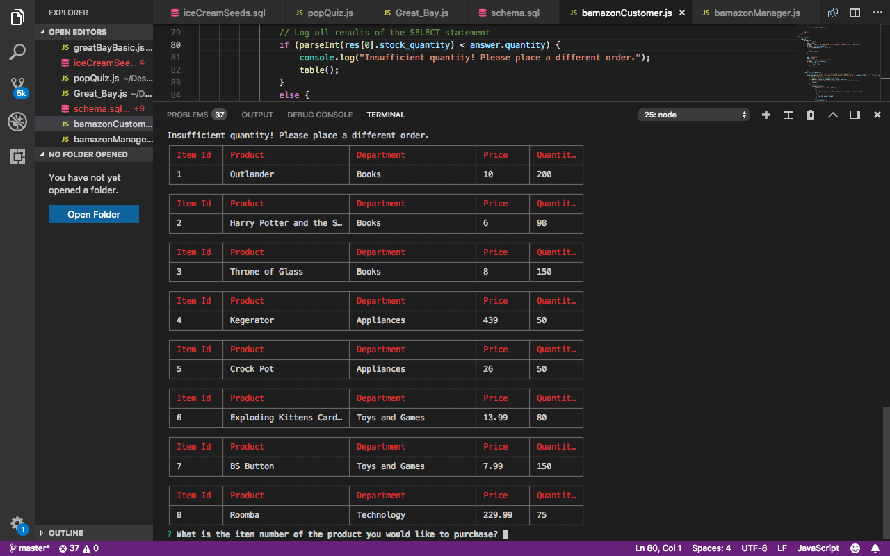

bamazonManager
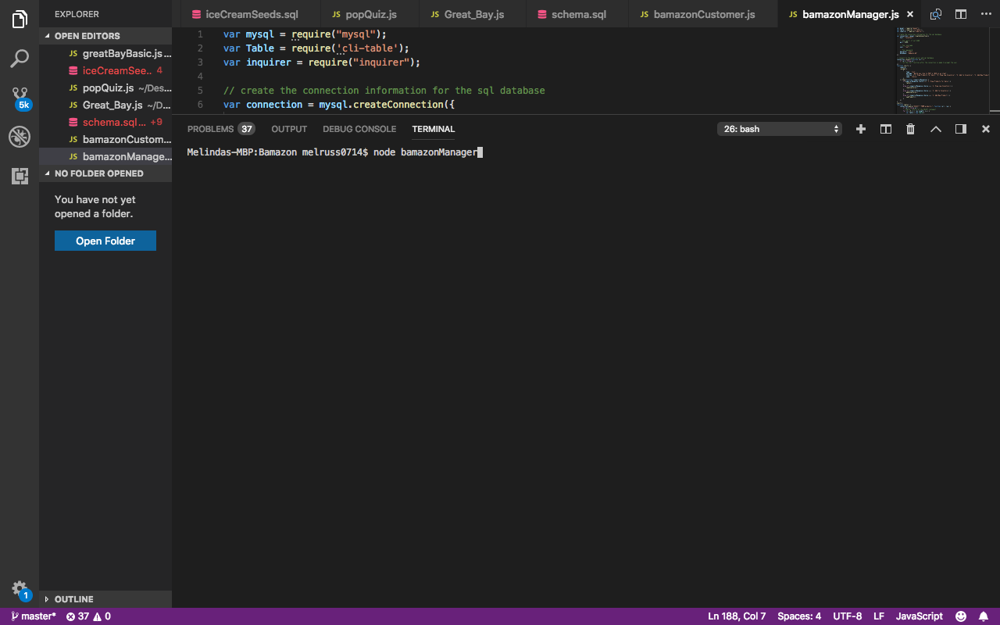

This is a node application that will:
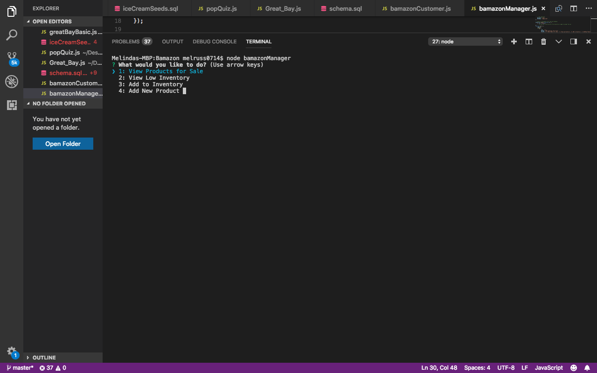

List a set of menu options:
View Products for Sale
View Low Inventory
Add to Inventory
Add New Product
If a manager selects View Products for Sale, the app will list every available item: the item IDs, names, prices, and quantities.

If a manager selects View Low Inventory, then it should list all items with an inventory count lower than five.
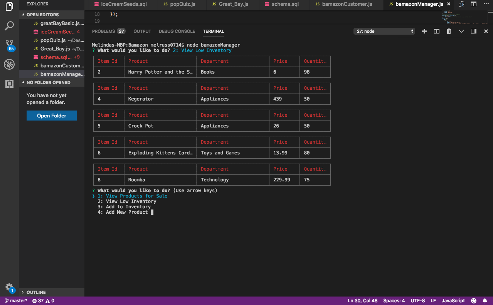

If a manager selects Add to Inventory, your app should display a prompt that will let the manager "add more" of any item currently in the store.
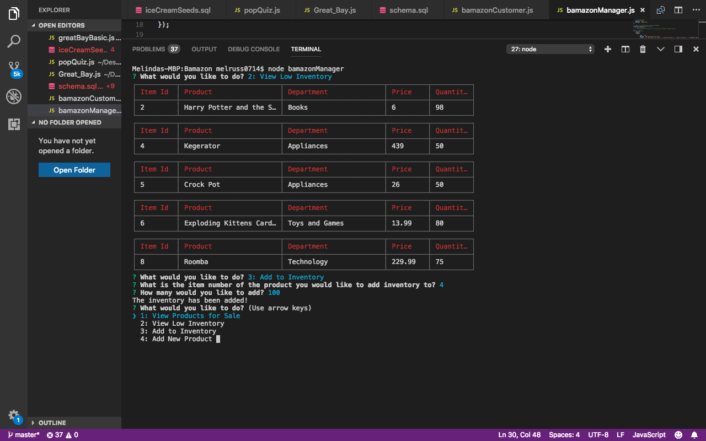

If a manager selects Add New Product, it should allow the manager to add a completely new product to the store.
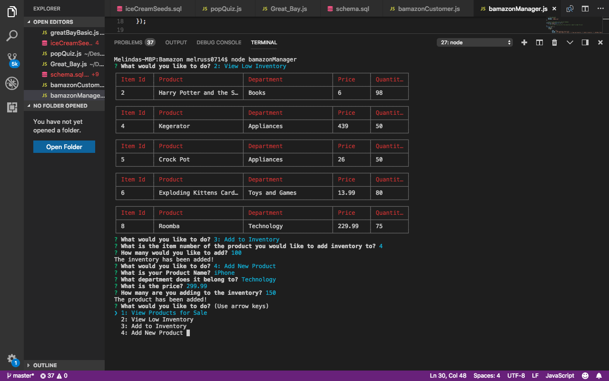

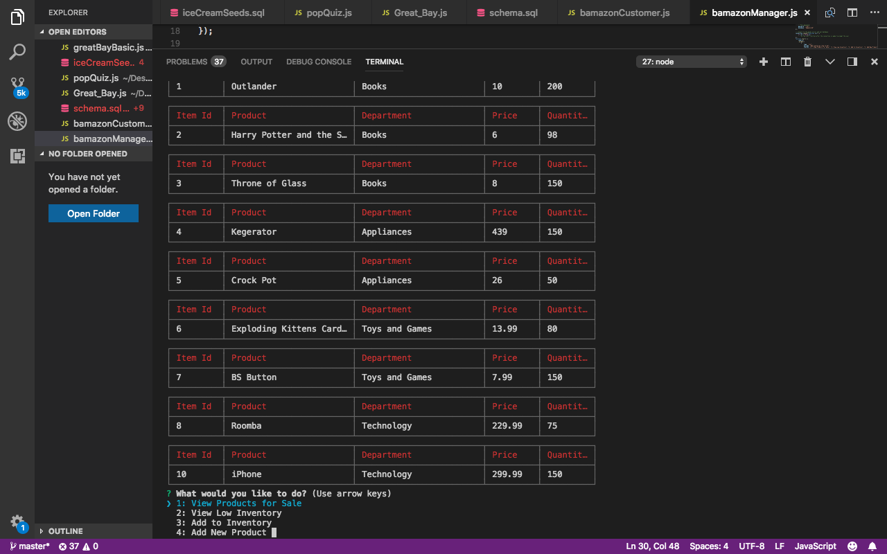

